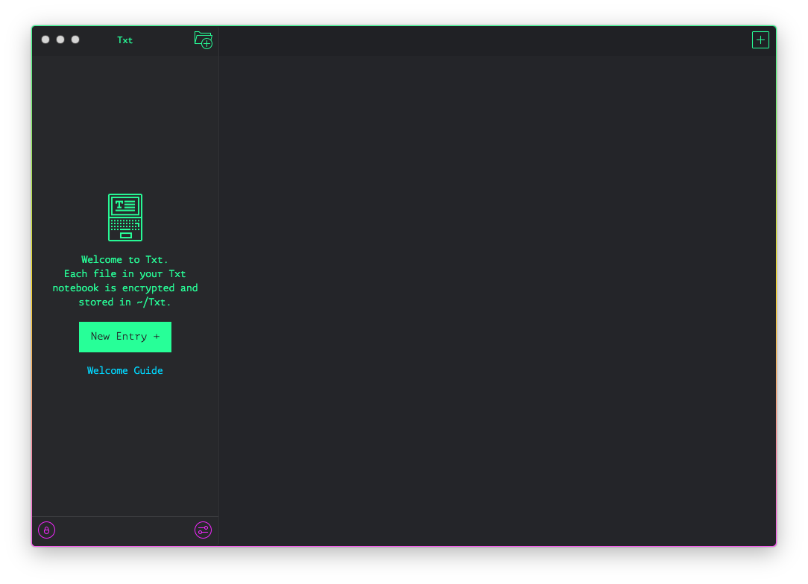

# Txt.app

Txt is a cute little private journalling app that keeps your work safe with [proven encryption](https://en.wikipedia.org/wiki/Pretty_Good_Privacy).

https://txtapp.io



## Getting Started

```
git clone git@github.com:shibacomputer/txt.git txt
cd txt
npm run setup
npm start

✨ 📝 🚀!
```
## Disclaimer

🚫 **DO NOT USE THIS FOR ANYTHING SERIOUS** 🚫  
🚫 **THIS IS A HUGE WORK IN PROGRESS** 🚫

## Features

So far:  
✅ Simple PGP-managed filesystem-based notekeeping  
✅ Text editor  
⬜️ Markdown support  
✅ Dark UI  
⬜️ Light UI  
✅ Keychain support  
⬜️ Export to [Are.na](https://are.na)  
⬜️ Export to [Medium](https://medium.com)  
⬜️ Export to PDF  
⬜️ Automatic image management  
⬜️ Secure syncing  
⬜️ Windows & Linux support  

Have a feature request? [Submit one](https://github.com/shibacomputer/txt/issues/new)
