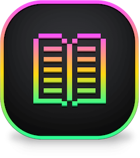
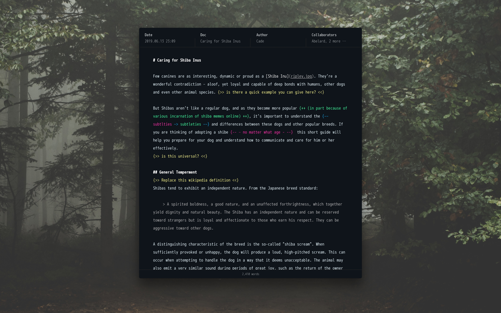

# Txt.app

Txt is a little word processor that keeps your work safe with
[well-documented encryption](https://en.wikipedia.org/wiki/Pretty_Good_Privacy).  
It is very nearly in Alpha!

https://shiba.computer



## Getting Started

```
git clone git@github.com:shibacomputer/txt.git txt
cd txt
📦 npm install
🔨 npm run rebuild
👉 npm start
✨ 📝 🚀!
```

This will install everything you need to build Txt successfully! 🎉  

## Development
Txt uses events to create simple patterns for interacting between Electron's `main` and `render` processes. Once I've cleaned up the beta, I'll write a little more about how this works and what the benefits are.

## Disclaimer
🚫 **THIS IS A HUGE WORK IN PROGRESS AND IS UNTESTED AND UNAUDITED** 🚫  
I can't stress this enough. This needs a lot of work, the code needs a huge cleanup, I need to write tests and it needs other eyes on it.

## License
Txt is licensed undder the [GPLv3](https://www.gnu.org/licenses/gpl-3.0.html).

## Why make this?
Txt is an opinionated statement on the relationship between personal work, data management and interaction. At time of writing, Txt is the only word processor that offers simple collaboration, document versioning and contact management implemented as such that it can run off of 1 or more USB sticks, or on public infrastructure, whilst offering the same UX on any system - including a live Tails install. In my considerations designing and building this, I'm trying to make sure it's really useful on a day to day basis without any sort of platform lock in. So long as you have access to the key, all Txt documents can be retreived without the app.

The beta focuses on text entry, but 1.0 will include image embeds, management, document histories and a few other features. We'll see where this goes from there.

Choosing [GPG encryption](https://gnupg.org/) and the filesystem as the app's foundation is deliberate. Rather than build a database, Txt relies solely on the filesystem. Anything you make with Txt can be read and reviewed somewhere else. On computers that are already set up with GPG, your work is accessible at a system level if you add the key to your GPG keychain. There is no import/export library tool, because adding one would be redundant. Everything used is off the shelf.

### Threat model
I'll write more on this later, but basically Txt is designed to allow you to store data in untrusted locations, such as a cloud service or on a USB stick.

The app assumes your currently running host system isn't compromised. In the beta, your passphrase is managed by your OS's keychain. The beta won't stop you from creating a terrible passphrase and using that. This will change and as I develop this further I will likely add alternate forms of authentication, eg physical keys or webauth or something else. For now, the goal is that, provided you take some basic steps to protect yourself (eg, taking care of your metadata and choosing a strong passphrase), it should be possible to store your work on untrusted infrastructure as long as a readable "Last Accessed" property is not something you need protected.

Finally, Txt does not protect anything that isn't stored by your filesystem. Your metadata - including the filenames of your work – is available to anyone who has access to the disk.

### Connectivity and Consent
Much like the app's stances on encryption and data portability, Txt will also treat all connection requests, like HTTPS, as a privilege. Txt uses a small [auto-updater](https://github.com/electron/update-electron-app/), served from Txt's website and for beta this is enabled by default. Before 1.0, Txt will allow its operator to completely block all connections. In this case, Txt's interface will explicitly ask for consent from its operator to connect to the internet to look for updates.

Txt contains no analytics and no logging. Outside of planned export and collaboration functionality, denying all connectivity should result in minimal feature degradation.

### Decentralisation
There are a number of projects in the works that seek to demonstrate collaborative document editing in a decentralised ecosystem. This is a major feature under consideration for Txt.

In a typical ecosystem, the legal or operational risk is centralised and the responsibility of an organisation through security and governance practices. In almost all p2p collaboration cases, these projects shift this risk onto their users by failing to devise solutions for individual privacy when participating as a node. The assumption that user privacy is an optional extra (and the related dismissal of criticism as paranoia) results in two outcomes: unsafe protocols being used in [unintended situations](https://blog.datproject.org/2017/12/10/dont-ship/) (eg as political tools), or apps and protocols running afoul of legislation simply through their design (eg the GDPR).

In much the same way as Txt respects connectivity as a privilege, communication and identification should be an empowering component to an author's interaction and self identity within a network. Txt will not ship with decentralised collaboration, but work will continue on this problem.

## Features
### Planned for beta
✅ Simple GPG-managed filesystem-based notekeeping  
✅ Text editor  
✅ Keychain support  
✅ Dark UI theme  
✅ Auto-updating  
✅ Linux support  
✅ GPG Private key encryption  
✅ Export to plain text file  
✅ i18n Support  
✅ Export to passphrase encrypted GPG text file  
⬜ Light UI theme  
⬜ Switch or replace keys  
⬜ Import existing text files  
⬜ Export to [Are.na](https://are.na)  
⬜ Export to PDF  

### Planned for v1.0
⬜ Contact management  
⬜ Collaboration / track changes  
⬜ Windows support  
⬜ Markdown support  
⬜ Decentralised software updates  
⬜ Localisation (First languages: French/Spanish/German/Japanese)  
⬜ Automatic image management  
⬜ In-app CLI  

### Language Support  
✅ 🇬🇧 English (100%)  
⬜ 🇩🇪 Deutsch (50%)  
⬜ 🇫🇷 Français (0%)  
⬜ 🇪🇸 Español (0%)  
⬜ 🇯🇵 日本語 (0%)  


### Big todos
⬜ Migrate from Electron to [Muon](https://github.com/brave/muon)  
⬜ Data management  
⬜ Better support for file permission edge cases  
⬜ Hardware 2FA / GPG support  

⬜ Filesystem privacy??  
⬜ TOR support??  
⬜ Secure syncing??  

### One day
⬜ Go native!

## Contacts
Txt has a [mailing list](https://tinyletter.com/txt-app). Join it for very
infrequent emails.  
Have a feature request? [Submit one](https://github.com/shibacomputer/txt/issues/new)!

## Donate
Once there's something you can actually use, I'll add donation links here!
