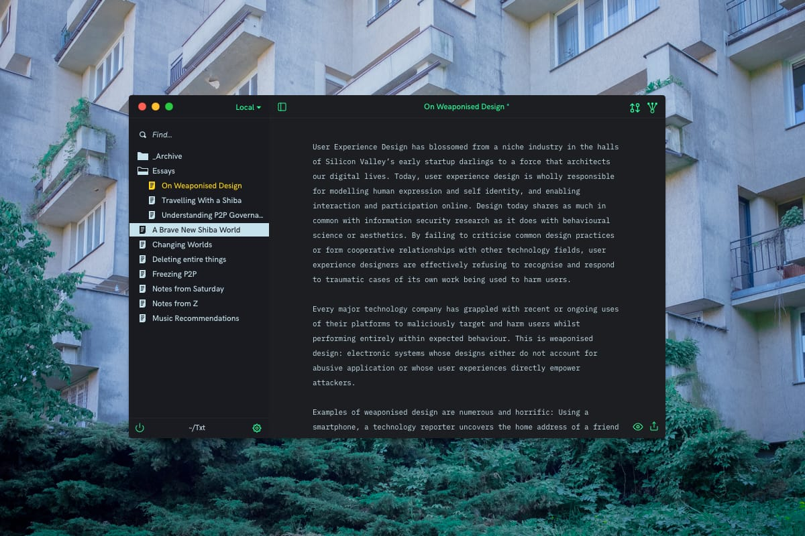

# Txt.app

Txt is a cute little private journalling app that keeps your work safe with
[well-documented encryption](https://en.wikipedia.org/wiki/Pretty_Good_Privacy).

https://txtapp.io



## Getting Started

```
git clone git@github.com:shibacomputer/txt.git txt
cd txt
npm run setup
```

__On Windows?__ If you don't already the
[Windows Build Tools](https://github.com/felixrieseberg/windows-build-tools)
installed, you must run these commands _instead_:  
```
git clone git@github.com:shibacomputer/txt.git txt
cd txt
npm install -g --production windows-build-tools
npm run setup
```

Then, once everything is set up:
```
👉 npm start
✨ 📝 🚀!
```

This will install everything you need to build Txt successfully! 🎉 

## Development
Txt uses events to create simple patterns for interacting between Electron's `main` and `render` processes. Once I've cleaned up the MVP, I'll write a little more about how this works and what the benefits are. _Todo: write more about the app logic._

If you're hacking on this lil app and you need to reset it, run:
```
npm run start:hard
```
This will delete your Txt preferences and start again. __(Note: this is macOS specific at this time!)__


## Disclaimer

🚫 **DO NOT USE THIS FOR ANYTHING SERIOUS** 🚫  
🚫 **THIS IS A HUGE WORK IN PROGRESS AND IS UNTESTED AND UNAUDITED** 🚫

I can't stress this enough. This needs a lot of work, and it needs others eyes
on it.

## Why?
It's pretty simple – I don't like the majority of text editors that exist today.
I either don't trust them enough to sync between devices, they lack features
I really want, or they're trustworthy and feature-rich but difficult to use.

Txt is an opinionated statement on the relationship between personal work, data
management and interaction. In my considerations building this, I'm trying to
make sure it's really useful on a day to day basis without any sort of platform
lock in. This MVP focuses on text entry, but 1.0 will include image embeds and
management. We'll see where this goes from there.

Choosing GPG and the filesystem as the app's foundation is deliberate. Rather
than build a database, it relies on the filesystem. Anything you make with Txt
can be read and reviewed somewhere else. There is no import/export tool, because
you don't need one. Everything used is off the shelf.

### Threat model
I'll write more on this later, but basically Txt is designed to allow you to
store data in untrusted locations, such as a cloud service or on a USB stick.

The app assumes your currently running host system isn't compromised. In the
MVP, your passphrase is managed by your OS's keychain. The MVP won't stop you
from creating a terrible passphrase and using that. This will change. For now,
the goal is that, provided you take some basic steps to protect yourself (eg,
taking care of your metadata and choosing a strong passphrase), it should be
possible to store your work on untrusted infrastructure.

Finally, Txt does not protect anything that isn't stored by your filesystem.
Your metadata - including the filenames of your work – is available to anyone
who has access to the disk.

## Features
### Planned for beta
✅ Simple GPG-managed filesystem-based notekeeping  
✅ Text editor  
✅ Keychain support  
✅ Dark UI theme  
✅ Auto-updating  
✅ Linux support  
✅ Windows support  
✅ Smart window management (smarter than my prototype at least)  
✅ GPG Private key encryption  
✅ Export to plain text file  
✅ i18n Support  
✅ Export to passphrase encrypted GPG text file  
⬜ Switch or replace keys  
⬜ Import existing text files  
⬜ Export to [Are.na](https://are.na)  
⬜ Export to PDF  

### Planned for v1.0
⬜ Search & Quick Open  
⬜ Light UI theme  
⬜ Markdown support  
⬜ Decentralised software updates  
⬜ Localisation (First languages: French/Spanish/German/Japanese)  
⬜ Automatic image management  
⬜ In-app CLI  

### Language Support  
✅ 🇬🇧 English (100%)  
⬜ 🇩🇪 Deutsch (50%)  
⬜ 🇯🇵 日本語 (10%)  
⬜ 🇫🇷 Français (0%)  
⬜ 🇪🇸 Español (0%)  

### Big todos
⬜ Migrate from Electron to [Muon](https://github.com/brave/muon)  
⬜ Data management  
⬜ Better support for file permission edge cases  
⬜ 2FA / Yubikey support  
⬜ Biometrics support  
⬜ Collaboration / track changes??  
⬜ Filesystem privacy??  
⬜ Secure syncing??  

### One day
⬜ Go native!

## Contacts
Txt has a [mailing list](https://tinyletter.com/txt-app). Join it for very
infrequent emails.  
Have a feature request? [Submit one](https://github.com/shibacomputer/txt/issues/new)!

## Donate
Once there's something you can actually use, I'll add donation links here!
